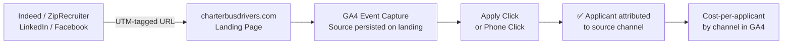

# Building the Attribution Stack Our Recruiter Needed
### One-day build that gave the recruiting and marketing team a professional tool — without paying an agency to do it

**Author:** Joshua Zimdars · Business Systems Specialist & EA to the CEO/CFO, Golden Limousine International  
**Status:** Live · charterbusdrivers.com  
**Stack:** Vanilla JS/CSS, GA4, UTM tracking, GitHub Pages

---

## TL;DR
Golden Limo has a recruiter and a marketing person. What they didn't have was a proper landing page and attribution stack for CDL driver hiring — the kind of thing an agency would charge $8–15K to build and six weeks to deliver. I shipped it in a day: one domain, four position types, two markets, full UTM-based source attribution, GA4 event tracking, and per-channel campaign URLs for Indeed, ZipRecruiter, LinkedIn, and Facebook. The team got a professional tool immediately. Leadership got cost-per-applicant visibility by source for the first time. No vendor, no delay.

---

## The Problem

Ground transportation has a structural hiring problem: every regional operator is fishing in the same shallow pool of CDL holders, and the major job boards (Indeed and ZipRecruiter) charge per click. Without proper attribution, you can't tell which channel is producing actual hires versus tire-kickers — so budget gets spread across everything and nothing gets optimized. Golden Limo had a recruiter, a marketing person, and an active hiring budget. What they were missing was a purpose-built page with a proper instrumentation layer underneath it.

Constraints:
- Four position types across two markets (Detroit and Ann Arbor), each with different shift profiles.
- Whatever I built had to load instantly on a phone — most CDL applicants apply from a parking lot on a break.
- The recruiter and marketing team needed to own the results, not interpret a spreadsheet.

## The Funnel



---

## The Approach

Two bets:

### Bet 1 — Instrument before spending another dollar
The cheap intervention was attribution, not creative. I built a single landing page, then layered on a complete UTM taxonomy (`utm_source`, `utm_medium`, `utm_campaign`, plus `utm_content` for position-level routing). Every channel got its own URL. Every campaign got its own URL.

```
charterbusdrivers.com?utm_source=indeed&utm_medium=paid&utm_campaign=q1-2025&utm_content=charter
charterbusdrivers.com?utm_source=ziprecruiter&utm_medium=paid&utm_campaign=q1-2025&utm_content=cdl
charterbusdrivers.com?utm_source=linkedin&utm_medium=paid&utm_campaign=professional&utm_content=executive
charterbusdrivers.com?utm_source=facebook&utm_medium=paid&utm_campaign=social-q1&utm_content=shuttle
```

The page captures source on landing, persists it, and forwards it through to the apply CTA so leadership can attribute *applications* (not just clicks) back to the channel that produced them.

### Bet 2 — GA4 event taxonomy that maps to the funnel
I defined the event schema before writing any tracking code:
- `page_view` (with source attribution)
- `scroll_depth` at 25 / 50 / 75 / 100%
- `apply_click` per position
- `phone_click`
- `benefit_card_interaction`
- `position_card_view`
- `time_on_page`

That gives me a five-step funnel in GA4 (visit → scroll → engage → apply-click → phone-click) and a clean answer to "what's our drop-off?"

## What I'd Do Differently

- **I'd have set up Google Ads from day one.** I built for organic + job-board paid traffic; we left a paid-search opportunity on the table for the first quarter. Easy fix.
- **The hero image bottleneck was real.** I built the page in a day; sourcing a non-branded motor-coach hero photo took a week. I should have shipped with a placeholder and iterated.
- **I should have tracked applicant→hire conversion, not just applicant volume.** The HR side of the funnel was opaque to my analytics. Fixing that next.

## Results

| Metric | Outcome |
|---|---|
| Cost-per-applicant visibility by channel | **0% → 100%** |
| Position types covered | 4 (Charter Bus, CDL Bus, PT Shuttle, Executive Black Car) |
| Markets | Detroit + Ann Arbor |
| Mobile load | sub-second (vanilla JS, no framework) |
| Channels with attribution | Indeed, ZipRecruiter, LinkedIn, Facebook, organic |

## Why this matters for S&O roles

This is the exact problem GCS Account Strategists solve for SMBs every day: an owner who knows they have a hiring/sales problem, who's spending money across channels, and who can't tell which channel is working. The answer is always the same — instrument the funnel, attribute the conversion, double down on what's working. I've now lived through that loop on the SMB side. I know what's hard about it (getting the *business* to trust the numbers, not the technology of capturing them).