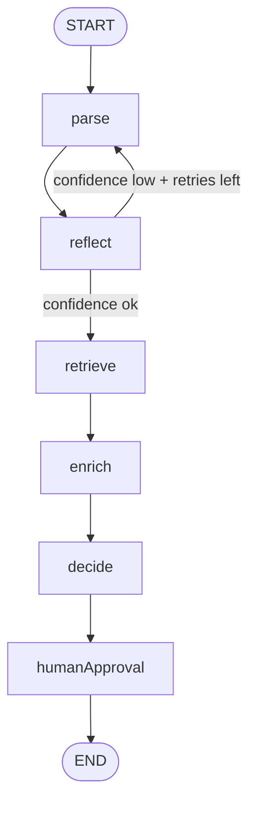

# Building a Vendor-Agnostic Agentic Core from Scratch
### LangGraph.js + Vertex AI Gemini + Azure AI Inference — portable, observable, production-shaped

**Author:** Joshua Zimdars  
**Status:** Active development · [GitHub →](https://github.com/jzimdars-RTG/JZ-genai-)  
**Stack:** Node.js 20+, LangGraph.js, Vertex AI (Gemini 2.0 Flash + text-embedding-004), Azure AI Inference (Kimi-K2), Python (LangGraph + langchain-google-vertexai), JSONL tracing

---

## TL;DR

I built a self-contained agentic toolkit — `jz-genai-agent-toolkit` — to go deep on how production agentic systems actually work. It's a vendor-agnostic LangGraph state graph with a multi-provider LLM layer, a self-reflection loop, RAG retrieval, human-in-the-loop gating, and structured per-call observability (tokens, cost, latency, p50/p95). The same patterns exist in both JavaScript and Python. Designed to be vendored into real systems via git subtree.

---

## Architecture



---

## Why I Built This

The Quote Calculator at Golden Limousine uses AI-assisted pricing — a prompt-to-structured-output pattern. It works, but the LLM call was a black box: no token counts, no cost tracking, no retry logic, no way to ask "did this call actually work well?" I built this toolkit to solve that — and to go deeper on the patterns I'd need to work on production agentic systems at scale.

This is the reusable core I'd extract from any customer engagement. Every decision was made with "can I hand this to another engineer and have them understand it in 10 minutes" as the bar.

---

## What It Does

**Multi-provider LLM routing.** A single `llmClient` abstraction routes calls to Vertex AI (Gemini 2.0 Flash) or Azure AI Inference (Kimi-K2). Primary provider is configurable; fallback activates on failure. The graph doesn't know which provider it's talking to — this is enforced at the interface boundary, not by convention.

**Reflection loop.** After `parse`, a `reflect` node scores its own output with a configurable confidence threshold (default 0.7). If confidence is below threshold and retries remain, it loops back to `parse`. This is the production pattern for reducing hallucinations without human review on every call.

**RAG retrieval.** A `retrieve` node runs after reflection passes. It embeds the input using Vertex AI `text-embedding-004`, scores a document corpus by cosine similarity, and injects the top-K most relevant chunks into state as `retrievedContext` before the enrich step. Falls back to TF-IDF bag-of-words if embeddings are unavailable. This is how real systems ground LLM output in authoritative data — rate cards, policy docs, customer history — without prompt-stuffing the full corpus on every call.

**Human approval gate.** Before the graph terminates, a `humanApproval` node runs. In `auto` mode it passes through; in `stdin` mode it prompts for operator approval. The gate is the same node either way — the mode is config, not code.

**LLM-native observability.** Every model call emits a JSONL line to `traces/run-{timestamp}.jsonl`:

```json
{
  "timestamp": "2026-05-18T12:00:00.000Z",
  "operationName": "agent.parse",
  "provider": "vertexai",
  "model": "gemini-2.0-flash-001",
  "inputTokens": 120,
  "outputTokens": 80,
  "totalTokens": 200,
  "costUSD": 0.000033,
  "latencyMs": 340,
  "success": true
}
```

`agent.printSummary()` aggregates call count, total cost, error rate, and p50/p95 latency across a run.

**Python agent.** The same ReAct + self-reflection + RAG pattern is implemented in `python/agent.py` using LangGraph (Python) and `langchain-google-vertexai`. Same state shape, same observability schema, same graph topology — in Python. This is the language most enterprise AI teams are running.

---

## Key Technical Decisions

| Decision | Why |
|---|---|
| LangGraph (not LangChain) | State graph gives explicit control over node transitions and retry edges. Abstractions that hide state are liabilities in production debugging. |
| Vendor-agnostic `llmClient` interface | The graph doesn't know which provider it's talking to. Provider-switching is a config change, not a refactor. |
| Cosine similarity RAG over Vertex AI embeddings | Real retrieval, not keyword matching. text-embedding-004 is production-grade; the TF-IDF fallback keeps the example runnable without credentials. |
| JSONL traces, not a dashboard | Structured logs compose into anything. A dashboard is a view on top; JSONL is the ground truth. |
| `git subtree` as the consumption model | No npm publish, no registry dependencies. The toolkit can be vendored directly into any project and updated with one command. |
| JavaScript and Python, not one or the other | The teams I'd be working with use both. The same patterns need to exist in both languages. |

---

## Repo Structure

```
src/
  agent/
    graph.js          ← LangGraph state graph
    state.js          ← AgentStateAnnotation
    nodes/
      parse.js        ← LLM-powered input parsing
      reflect.js      ← confidence scoring + retry logic
      retrieve.js     ← RAG: embed → cosine similarity → top-K context injection
      enrich.js       ← context enrichment
      decide.js       ← decision node
      humanApproval.js← operator gate
  llm/                ← provider adapters (Vertex AI, Azure AI)
  observability/      ← JSONL tracer + metrics + summary printer
  utils/
examples/
  simple-parse/       ← minimal runnable example
  email-quote/        ← full email-to-quote flow
  rag-retrieval/      ← RAG example with limo/dispatch knowledge base
python/
  agent.py            ← Python LangGraph agent (ReAct + RAG + observability)
  requirements.txt
tests/
traces/               ← JSONL run logs (gitignored)
```

---

## Usage

```js
import { createAgent } from "jz-genai-agent-toolkit";

const agent = createAgent();
const result = await agent.run({
  inputText: "Need a quote from Ann Arbor to DTW",
  documents: pricingKnowledgeBase  // optional RAG corpus
});
console.log(result.state);
agent.printSummary();
```

```python
# python/agent.py
from agent import build_graph

graph = build_graph()
result = graph.invoke({"input_text": "Need a quote from Ann Arbor to DTW"})
print(result["decision"])
```

---

## What I'd Do Differently

- **Start with structured evals, not just unit tests.** I have tests for node logic, but no eval harness that scores LLM output quality across a dataset. That's the thing that actually tells you whether a prompt change was an improvement.
- **Persist traces to a database from day one.** JSONL files are fine for local dev but you lose cross-run aggregation. Even a simple SQLite append would make cost trending much easier.
- **Ship the Python agent first on the next project.** Most enterprise customers are Python-first. The JS toolkit came first because that's what the Quote Calculator runs on — but the Python port should be the lead artifact next time.

---

## Why This Matters for FDE Roles

This project is direct evidence of FDE-specific skills — not just AI literacy:

- **"Transition from rapid prototypes to production-grade agentic workflows."** The Quote Calculator email parser was the prototype. This toolkit is the production-grade extraction of the patterns that worked.
- **"Build high-performance evaluation pipelines and observability frameworks."** Per-call JSONL telemetry with p50/p95 latency, cost-per-request, and error rate — not an afterthought, a first-class design requirement.
- **"Identify recurring field patterns and friction points, converting them into reusable modules."** This entire toolkit is that — field-observed patterns extracted into a reusable, vendorable core.
- **"Vendor-agnostic"** isn't a buzzword here — it's a concrete architectural choice enforced at the `llmClient` interface boundary so the graph works with Vertex AI, Azure AI, or any future provider.
- **RAG is the missing piece** in most LLM deployments I've seen. Grounding model output in authoritative retrieval — and being able to measure whether the retrieval is working — is the difference between a demo and a production system.
