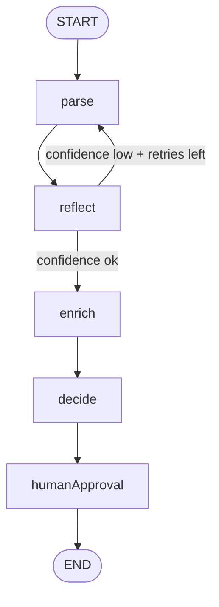

# Building a Vendor-Agnostic Agentic Core from Scratch
### LangGraph.js + Vertex AI Gemini + Azure AI Inference — portable, observable, production-shaped

**Author:** Joshua Zimdars  
**Status:** Active development · [GitHub →](https://github.com/jzimdars-RTG/JZ-genai-)  
**Stack:** Node.js 20+, LangGraph.js, Vertex AI (Gemini 2.0 Flash), Azure AI Inference (Kimi-K2), JSONL tracing

---

## TL;DR

I built a self-contained agentic toolkit — `jz-genai-agent-toolkit` — as a personal project to go deep on how production agentic systems actually work. It's a vendor-agnostic LangGraph state graph with a parse → reflect → enrich → decide → human approval loop, multi-provider LLM routing with automatic fallback, and LLM-native observability (tokens, cost USD, latency, p50/p95). The whole thing can be dropped into any Node project via `git subtree`.

---

## Architecture



---

## Why I Built This

The Quote Calculator at Golden Limousine uses AI-assisted pricing — a prompt-to-structured-output pattern. It works, but the LLM call is a black box: no token counts, no cost tracking, no retry logic, no fallback if Vertex goes down. I wanted to build the thing I'd want underneath that system: a proper agentic core where observability and resilience are first-class, not afterthoughts.

---

## What It Does

**Multi-provider LLM routing.** A single `llmClient` abstraction routes calls to Vertex AI (Gemini 2.0 Flash) or Azure AI Inference (Kimi-K2). Primary provider is configurable; fallback activates automatically on failure. Switching providers is a one-line `.env` change — no code changes.

**Reflection loop.** After `parse`, a `reflect` node scores its own output with a configurable confidence threshold (default 0.7). If confidence is below threshold and retries remain, it loops back to `parse`. This pattern eliminates a whole class of silent bad outputs.

**Human approval gate.** Before the graph terminates, a `humanApproval` node runs. In `auto` mode it passes through; in `stdin` mode it prompts for operator approval. The gate is the same node either way — easy to make it a webhook, Slack message, or UI component later.

**LLM-native observability.** Every model call emits a JSONL line to `traces/run-{timestamp}.jsonl`:

```json
{
  "timestamp": "2026-05-18T12:00:00.000Z",
  "operationName": "agent.parse",
  "provider": "vertexai",
  "model": "gemini-2.0-flash-001",
  "inputTokens": 120,
  "outputTokens": 80,
  "totalTokens": 200,
  "costUSD": 0.000033,
  "latencyMs": 340,
  "success": true
}
```

`agent.printSummary()` aggregates call count, total cost, error rate, and p50/p95 latency across a run. This is the instrumentation layer I'd build into the Quote Calculator next.

---

## Key Technical Decisions

| Decision | Why |
|---|---|
| LangGraph.js (not LangChain) | State graph gives explicit control over node transitions and retry edges. LangChain abstractions hide too much for a learning project. |
| Vendor-agnostic `llmClient` interface | The graph doesn't know which provider it's talking to. This is what makes the fallback and provider-switching work without touching graph code. |
| JSONL traces, not a dashboard | Structured logs compose into anything. A dashboard is a view on top; JSONL is the ground truth. |
| `git subtree` as the consumption model | No npm publish, no registry dependencies. The toolkit can be vendored directly into any project and updated with one command. |

---

## Repo Structure

```
src/
  agent/
    graph.js          ← LangGraph state graph
    state.js          ← AgentStateAnnotation
    nodes/
      parse.js        ← LLM-powered input parsing
      reflect.js      ← confidence scoring + retry logic
      enrich.js       ← context enrichment
      decide.js       ← decision node
      humanApproval.js← operator gate
  llm/                ← provider adapters (Vertex, Azure)
  observability/      ← JSONL tracer + summary printer
  utils/
examples/             ← runnable examples
tests/
traces/               ← JSONL run logs (gitignored)
```

---

## Usage

```js
import { createAgent } from "jz-genai-agent-toolkit";

const agent = createAgent();
const result = await agent.run({ inputText: "Need a quote from Ann Arbor to DTW" });
console.log(result.state);
agent.printSummary();
```

---

## What I'd Do Differently

- **Start with structured evals, not just unit tests.** I have tests for node logic, but no eval harness that scores LLM output quality across a dataset. That's the thing that actually tells you if a model change made things better or worse.
- **Persist traces to a database from day one.** JSONL files are fine for local dev but you lose cross-run aggregation. Even a simple SQLite append would make cost trending much easier.

---

## Why This Matters

This project is evidence that I'm not just a user of AI tools — I can build the infrastructure layer underneath them. The skills that produced this (LLM routing, agentic state machines, observability design, vendor abstraction) are the same skills that go into production AI systems at Google Cloud, Anthropic, or any team building on top of foundation models.

- **"Vendor-agnostic"** isn't a buzzword here — it's a concrete architectural choice enforced at the `llmClient` interface boundary.
- **The reflection loop** is a production pattern for reducing hallucinations without human review on every call.
- **The observability layer** exists because you can't improve (or justify the cost of) what you can't measure.
