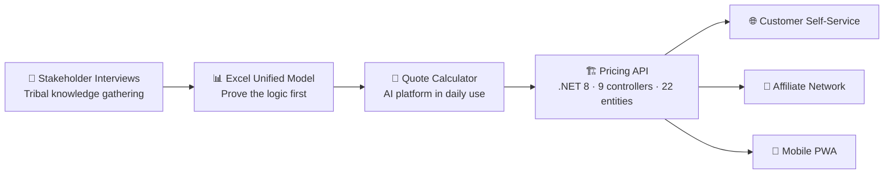

# The Pricing Foundation That Makes Everything Else Possible
### Re-platforming a unified pricing model as a .NET 8 / EF Core / Azure SQL API — chapter three of the same story

**Author:** Joshua Zimdars  
**Status:** Phase 1 complete · API live · Customer-facing surface area in design  
**Stack:** .NET 8, ASP.NET Core 8, Entity Framework Core 8, SQL Server / Azure SQL, Swagger, PowerShell

---

## The Arc

---

## Context: where this fits in the arc

This is the third chapter of the same project.

- **Chapter one:** Pricing knowledge was scattered across people and tribal memory. I interviewed every stakeholder and built the company's first unified pricing model — 7 zones, 4 tiers, 14 trip types, 14 vehicle classes. Proved it in Excel first.
- **Chapter two:** Turned that model into the Quote Calculator — a production AI platform that prices any trip in under 3 minutes and lets reservationists focus on the customer instead of the math.
- **Chapter three (this):** The Excel file that proved the model can't be queried by other systems and can't be safely changed without breaking things. Pricing has to become a *service* — so the same source of truth that powers the Quote Calculator today can power a customer self-service site, an affiliate operator network, and a mobile PWA tomorrow without a rebuild.

## TL;DR
I rebuilt the unified pricing model as a versioned .NET 8 API with 9 controllers and 22 entities. Every pricing concept — vehicles, rates, day-of-week modifiers, holiday overrides, surcharges, zones, transfer pricing — is now a Swagger-documented CRUD resource. The Quote Calculator already runs on it. Every future initiative is cheaper because of it.

## The Problem
A spreadsheet rate card — even a well-designed one — has two failure modes: it can't be queried by other systems, and it can't be safely changed without breaking downstream tools nobody documented. Both were true. The Quote Calculator was already consuming the pricing logic directly from `config.js`; that worked for one tool. It won't work for five. To unlock the next decade — customer self-service booking, an affiliate operator network, multi-currency international charter — pricing had to become a service with a contract, not a file with a password.

## The Approach
- **API-first.** Every concept (vehicles, pricing rules, day-of-week modifiers, time-of-day modifiers, holiday overrides, add-ons, surcharges, transfer zones, transfer pricing) became a CRUD resource with a Swagger-documented contract.
- **Soft-delete + audit by default.** No "delete" in this domain ever means "actually delete" — pricing changes need to be auditable.
- **PowerShell as the dev story.** `setup.ps1`, `run.ps1`, `migrate.ps1`, `seed-data.ps1` — anyone who joins the team can be productive in under 10 minutes.
- **Phased rollout.** I authored a 10-phase roadmap (Foundation → Pricing Engine → Admin Portal → Customer Booking → AI Auto-Quote → Integrations → Affiliate Network → Customer Portal → Multi-Currency → Mobile + Polish). Each phase gates the next.

## What I'd Do Differently
- I should have shipped versioned pricing rules from Phase 1, not Phase 3. Retrofitting versioning is harder than including it.
- I underweighted observability. Phase 1 has Swagger but no structured logging or metrics. Adding that next.

## Why this matters for S&O roles

The GCS S&O role is about creating leverage — building systems and strategies that make every future initiative cheaper and faster. That's exactly what this is.

- **"Develop comprehensive strategies that solve complex business challenges."** The API is the infrastructure layer of a 10-phase business strategy. Each phase (self-service booking → affiliate network → multi-currency) unlocks incremental growth without a platform rebuild.
- **"Define actionable plans and roadmaps and align cross-functional stakeholders."** The 10-phase roadmap is a sequenced, gated plan where each phase conditions the next. It's the document that aligns the CEO, the ops team, and any future engineering hire to a single shared trajectory.
- **"Design processes, tools, and operating cadences."** Soft-delete, audit trails, PowerShell dev scripts, and a Swagger contract aren't engineering choices — they're process choices. They make the system maintainable by anyone, not just me.