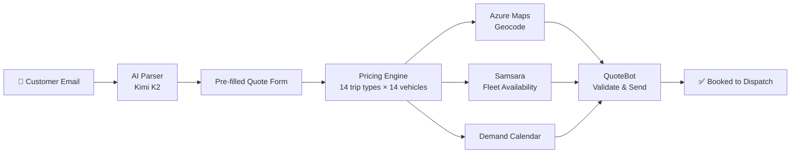

# Rebuilding Sales Operations at a 100-City SMB
### The Quote Calculator: an AI-assisted pricing & dispatch platform that cut sales response 10x — *currently in active development*

**Author:** Joshua Zimdars · Business Systems Specialist & EA to the CEO/CFO, Golden Limousine International  
**Status:** ⚒️ **In active development** · Already in daily use by sales and dispatch  
**Stack:** Vanilla JS (ES modules), Node.js proxy, Azure AI Inference (Kimi K2), Azure Maps, QuoteBot API, Samsara API, Playwright

> **Note:** This is a living system. Features ship weekly. Metrics below reflect the current state — they will move as new pricing categories, integrations, and AI capabilities come online.

---

## TL;DR
Pricing knowledge at Golden Limo was scattered across a dozen people, tribal memory, and spreadsheets no one fully owned. No two reservationists priced the same trip the same way. I interviewed every stakeholder, unified the logic, and built the company's first complete pricing model — starting in Excel to prove it worked, then shipping it as a production AI platform. The **Quote Calculator** AI-parses a customer email, prices any trip instantly across 14 trip types and 14 vehicle classes, validates with dispatch, and books the job. Median quote time: under 3 minutes, down from 20–34. Reservationists stopped doing pricing math and started focusing on the customer.

---

## The Problem

Four things were true at once:
1. **Pricing knowledge lived in people, not systems.** Every experienced reservationist had their own rules; every new hire was a liability.
2. **Sales was a bottleneck.** Median time-to-quote: 20–34 minutes per request, in a category where customers are shopping three vendors at once.
3. **Pricing was inconsistent across reps.** Same trip, different price.
4. **The highest-revenue category — multi-day charter — was priced on intuition** with no DOT compliance check, no demand model, no margin discipline.

## The Approach

Three sequential bets:

**Bet 1 — Centralize pricing logic before automating anything.** `pricing.js` is a pure function library with zero DOM access; `config.js` is the single source of truth for every rate, surcharge, and contract rule. If the math was wrong, every downstream feature would be wrong.

**Bet 2 — Make the boring 80% disappear.** Most quotes are airport transfers, P2P, or hourly charter. The UI makes those 30 seconds of typing. Azure Maps geocodes addresses; Samsara surfaces live fleet availability; a Node proxy keeps every credential server-side.

**Bet 3 — Earn the right to do the hard parts.** Only after daily adoption did I add (a) the AI email parser (Kimi K2 via Azure AI Inference) that turns a customer email into a pre-filled quote, and (b) the OTR cost-plus engine with DOT Hours-of-Service compliance.

## The System (current)

Notable design choices: no build step, vanilla ES modules, single-file Node proxy, demand calendar as a config file, full Playwright regression suite, rate-limit-aware on-disk catalog caching.

## What I Got Wrong (so far)

- **Shipped the AI parser before instrumenting it.** Lost a month before I added field-level logging and discovered the parser was reliably wrong on multi-leg event itineraries. *Fixed with a second specialized prompt.*
- **Underestimated the change-management curve.** Two senior dispatchers preferred the old workflow for six weeks. Sitting next to them at the dispatch desk fixed it — the biggest single adoption lift came from moving one button.
- **Didn't version `config.js` from day one.** Now every config change is committed; we can replay any quote against the rate card that was live the day it was given.

## Results (current state)

| Metric | Before | Now |
|---|---|---|
| Median time-to-quote | 20–34 min | **2–3 min** |
| Pricing variance across reps | Material | **Zero** |
| OTR quotes with structured cost basis | 0% | **100%** |
| Hours saved annually (estimated) | — | **~1,800+** |

## What's Next (the in-development part)

- **Customer self-service quoting site** sitting on top of the same pricing engine.
- **Affiliate network pricing** — partner operators booking jobs against our rates.
- **Multi-currency** for international charter requests.
- **AI-powered auto-quote** that returns a preliminary quote inside an email reply within seconds of inquiry.
- **Mobile PWA** for sales reps in the field.

The 10-phase rollout plan is documented and tracked.

## Why this matters for S&O roles

This project maps to every responsibility in the GCS S&O job description:

- **"Draw interpretable insights from sophisticated business analyses."** The demand calendar and 7-zone pricing model are the analysis layer. Every quote is priced against a model I can defend number by number to an executive.
- **"Design processes, tools, and operating cadences."** The Quote Calculator *is* the process redesign. It replaced a tribal, ad-hoc quoting workflow with a structured, auditable operating cadence.
- **"Develop comprehensive business strategies that solve complex challenges."** Structured discovery across every function → unified model → phased platform rollout. That's the strategy sequence, not just a feature ship.
- **"Communicate data-driven recommendations to leadership."** The demand calendar feeds the CEO's weekly forecast. The pricing model is the source of every revenue conversation the executive team has.
- **"Define actionable plans and align cross-functional stakeholders."** The 10-phase roadmap is a gated product plan. The change-management work — sitting next to dispatchers until adoption happened — is the stakeholder alignment story.