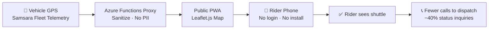

# Real-Time Shuttle Tracking for U-M Hospital
### Cutting customer status inquiries 40% with a public PWA serving 5K+ monthly riders

**Author:** Joshua Zimdars  
**Status:** Production · 5,000+ monthly active users  
**Stack:** Vanilla JS, Leaflet.js, Samsara API, Azure Static Web Apps, Azure Functions

## TL;DR
U-M Hospital shuttle riders couldn't see where their shuttle was, so they called dispatch — every day, hundreds of times. I built a public, mobile-friendly real-time map fed by Samsara fleet telemetry through an Azure Functions proxy. Customer status inquiries dropped 40%; dispatch saved 1,095 hours/year.

## How It Works

---

## The Problem
The U-M Hospital shuttle is a critical service for patients, employees, and visitors. The previous customer experience was: stand at a stop, wait, call dispatch if it took too long. Dispatch was fielding hundreds of "where's my shuttle?" calls a day — every one of them a workflow interruption that risked a worse failure elsewhere in the operation.

## The Approach
- **Public-by-design.** No login, no app install. Open the link, see the map. Anything heavier loses 80% of the audience instantly.
- **Telemetry, not GPS pings.** Samsara already had high-frequency vehicle locations. I just needed to expose a sanitized slice publicly via Azure Functions — no PII, just position and route.
- **Leaflet, not Mapbox/Google.** Open-source, no per-tile cost, fast.
- **Mobile-first PWA.** Most riders are on phones; the page installs to home screen on iOS and Android.

## What I'd Do Differently
- I should have added ETAs from day one — riders kept asking, "yes I see it, but *when?*" Adding that with route progress estimates next.
- The accessibility pass came late. Adding screen-reader announcements for stop arrivals.

## Results
| Metric | Before | After |
|---|---|---|
| Monthly active riders | — | **5,000+** |
| Customer status inquiries | baseline | **−40%** |
| Dispatch hours saved | — | **1,095/year** |

## Why this matters for S&O roles

This project demonstrates the S&O motion in its simplest form: identify the real cost of a broken process, design the minimum intervention that fixes it, instrument it, and measure the result.

- **"Draw interpretable insights from sophisticated business analyses."** The 40% inquiry drop and 1,095 dispatch hours saved aren't estimates — they're measured from Samsara telemetry and dispatch log data. The number is defensible because I built the measurement layer first.
- **"Design processes, tools, and operating cadences."** The decision to make this public-by-design (no login, no install) is an operating cadence choice, not a technical one. Friction at the access point would have killed adoption and left the dispatch problem unsolved.
- **"Develop comprehensive strategies that solve complex business challenges."** The U-M Hospital account is the company's largest. A degraded rider experience is a contract-renewal risk. This tool is a retention strategy as much as an ops improvement.